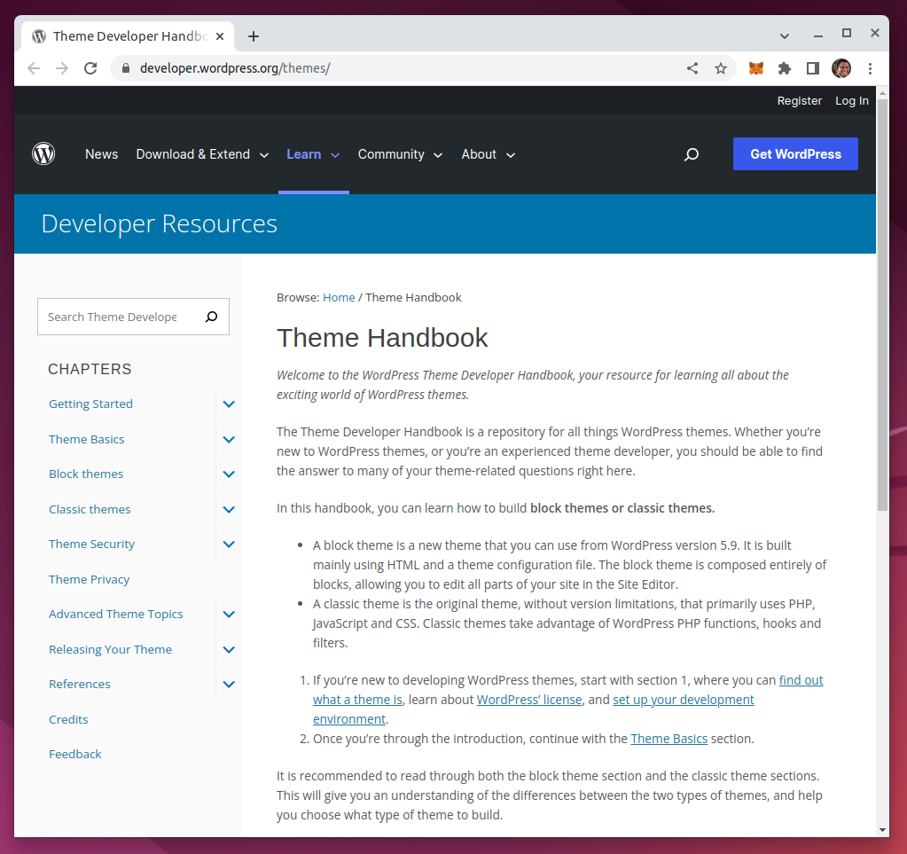

# WordPress Theme Developer

The Exciting World of WordPress Themes

## WordPress Theme Handbook

https://developer.wordpress.org/themes/



# Rewind Posts

You can use rewind_posts() to loop through the same query a second time. This is useful if you want to display the same query twice in different locations on a page.

```php
rewind_posts();
```